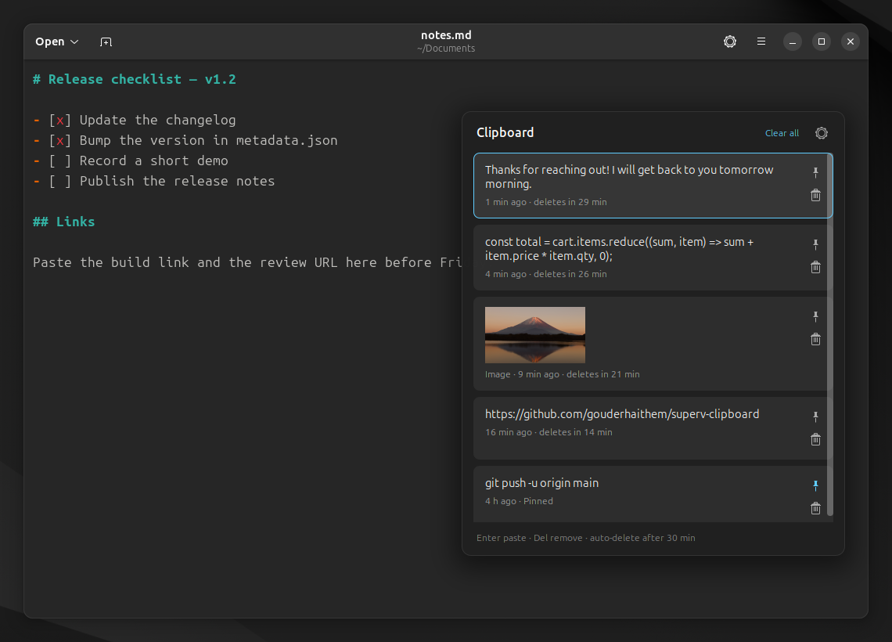
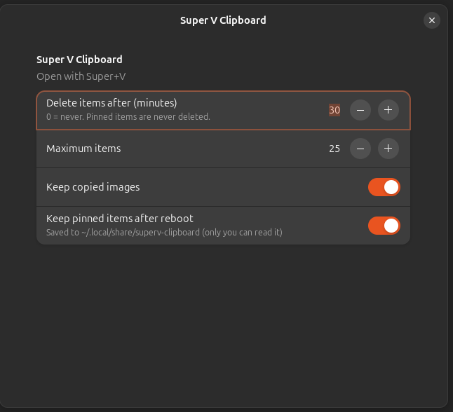

<div align="center">


# Super V Clipboard

**Windows-style clipboard history for GNOME. Press <kbd>Super</kbd>+<kbd>V</kbd>, pick what you copied earlier, and it gets pasted.**

Copied items delete themselves after a time you choose, so passwords and other sensitive text don't hang around.


[](https://github.com/gouderhaithem/superv-clipboard/actions/workflows/ci.yml)



</div>

## Features

- **<kbd>Super</kbd>+<kbd>V</kbd> panel**: opens next to your mouse, in the style of the Windows 11 clipboard.
- **Click to paste**: picking an item pastes it straight into the window you were using. Terminals get <kbd>Ctrl</kbd>+<kbd>Shift</kbd>+<kbd>V</kbd> automatically.
- **Auto-delete timer**: unpinned items are removed after 30 minutes by default. Each item shows how long it has left.
- **Pin** 📌 the things you paste all the time. Pinned items never expire and survive a reboot.
- **Text and images**: copied screenshots and pictures show up as previews.
- **Skips passwords**: anything a password manager (KeePassXC and others) marks as secret is never recorded. Nothing is recorded while the screen is locked.
- **Keyboard first**: <kbd>↑</kbd> <kbd>↓</kbd> to move, <kbd>Enter</kbd> to paste, <kbd>Del</kbd> to remove, <kbd>Esc</kbd> to close.
- **Light on resources**: no background process and no extra runtime. It runs inside GNOME Shell and only wakes up when you copy something.

<div align="center">

</div>

## Install

Requires **GNOME Shell 46** (for example Ubuntu 24.04). Works on both Wayland and X11.

```bash
git clone https://github.com/gouderhaithem/superv-clipboard.git
cd superv-clipboard
./install.sh
```

Then **log out and log back in**. On Wayland, GNOME Shell can't load a new extension until you do. Press <kbd>Super</kbd>+<kbd>V</kbd> and you're set.

> **Note:** Super+V takes priority over GNOME's own Super+V shortcut for the notification list. You can still open notifications with <kbd>Super</kbd>+<kbd>M</kbd>.

## Usage

| Action | How |
| --- | --- |
| Open / close | <kbd>Super</kbd>+<kbd>V</kbd> |
| Paste an item | Click it, or select it and press <kbd>Enter</kbd> |
| Move through the list | <kbd>↑</kbd> <kbd>↓</kbd> <kbd>Home</kbd> <kbd>End</kbd> |
| Delete an item | 🗑 button or <kbd>Del</kbd> |
| Pin / unpin | 📌 button |
| Clear everything (except pinned) | **Clear all** |
| Settings | ⚙ button in the panel |

## Settings

Open them from the ⚙ button in the panel, or run `gnome-extensions prefs superv-clipboard@gouderhaithem.github.io`.

| Setting | Default |
| --- | --- |
| Delete items after (minutes, `0` = never) | 30 |
| Maximum items | 25 |
| Keep copied images | On |
| Keep pinned items after reboot | On |

To change the shortcut:

```bash
gsettings --schemadir ~/.local/share/gnome-shell/extensions/superv-clipboard@gouderhaithem.github.io/schemas \
  set org.gnome.shell.extensions.superv-clipboard toggle-shortcut "['<Super><Shift>v']"
```

## Privacy

- Your history is kept **in memory only** and never leaves your computer.
- Only **pinned** items are written to disk, in `~/.local/share/superv-clipboard/pinned.json`, which only your user can read. Turn off *Keep pinned items after reboot* to keep pinned items in memory too.
- Password-manager copies are ignored, and nothing is recorded while the screen is locked.

## Why a GNOME Shell extension?

On Wayland, normal apps aren't allowed to read the clipboard in the background, register a global shortcut, or send a paste keystroke to another window. That is by design, for security. Code running inside GNOME Shell is allowed to do all three, so an extension is the only way to get a real <kbd>Super</kbd>+<kbd>V</kbd> clipboard on modern Ubuntu. It also means there is no separate process using memory.

## Uninstall

```bash
./uninstall.sh
```

This removes the extension and asks whether to delete your saved pinned items.

## Development

```
extension/
├── extension.js   # wiring: shortcut, timers, lifecycle
├── history.js     # history list, expiry, pinning
├── storage.js     # saves/loads pinned items in the background
├── monitor.js     # watches the clipboard
├── paster.js      # puts an item on the clipboard and sends the paste keys
├── popup.js       # the Super+V panel
├── format.js      # previews and "5 min ago" labels
├── thumbnail.js   # decodes image previews in the background
├── prefs.js       # settings window (libadwaita)
├── stylesheet.css
└── schemas/
```

Run the tests:

```bash
gjs -m tests/history.test.js                   # unit tests (history, expiry, thumbnails)
dbus-run-session -- tests/shell-smoke.sh       # loads the extension in a throwaway headless GNOME Shell
```

`shell-smoke.sh` copies images and text from a real Wayland client (`wl-copy`), opens the panel repeatedly, pastes an image back, and checks that GNOME Shell never crashes. It runs fully isolated from your desktop. It needs `wl-clipboard` and `python3-pil`.

You can try changes without logging out by running a GNOME Shell in a window:

```bash
./install.sh
dbus-run-session -- gnome-shell --nested --wayland
```

Watch for errors with `journalctl -f -o cat /usr/bin/gnome-shell`.

## Contributing

Issues and pull requests are welcome. Support for other GNOME versions is especially welcome, since only 46 has been tested so far.

## License

[MIT](LICENSE) © Gouder Haithem
